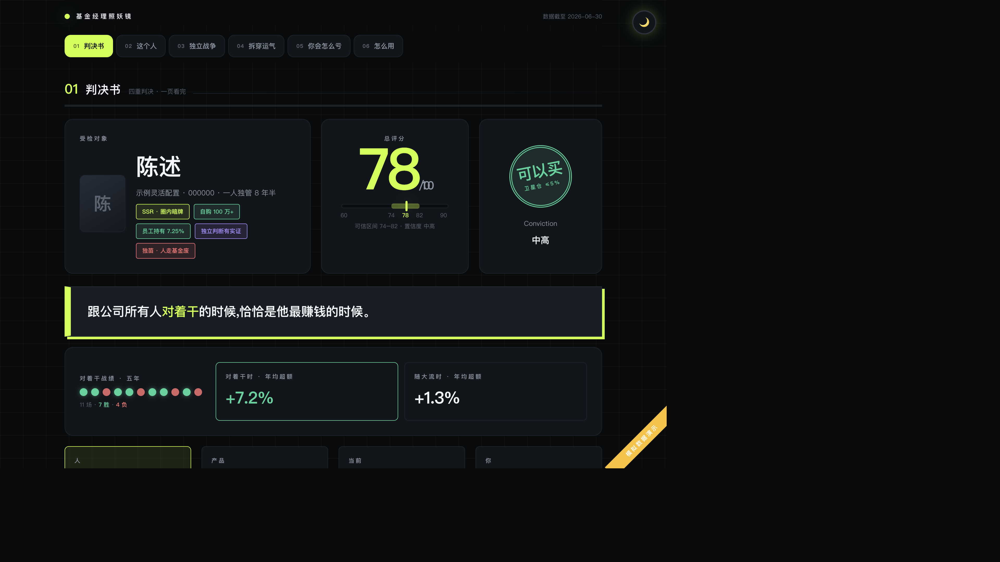
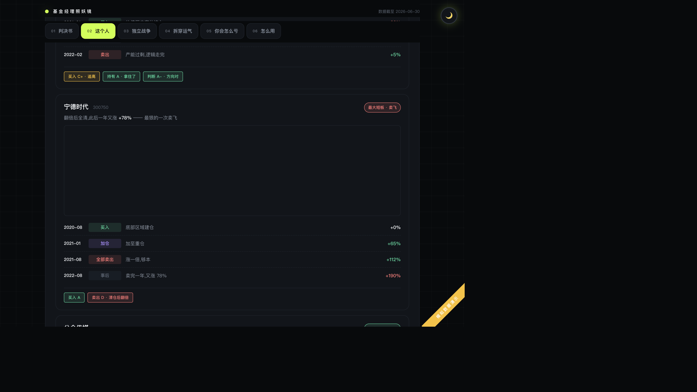

# 基金经理照妖镜

> 用真实公开数据，把一个基金经理的每一笔买卖翻出来验 —— **评的是行为，不是净值。**

这是一个 Agent Skill（配套参考实现管线），产出一份单文件、可直接分享的 HTML 深度报告。

**在线示例**：兴全合宜（163417）· 谢治宇 → [wbh604.github.io/fund-manager-xray/assets/fund-163417.html](https://wbh604.github.io/fund-manager-xray/assets/fund-163417.html)（也可下载 [`assets/fund-163417.html`](assets/fund-163417.html) 离线打开）。



## 它回答什么问题

普通基金评价看净值曲线打分；这里把经理的**长期行为**拆开验：

- **买卖点验尸** —— 每次买入/清仓，拿 12 个月后的真实走势验对错（卖飞只认主动清仓；触 10% 双十线、遭赎回的被动减仓自动剔除，不算他的决策）
- **战役回放** —— 真实周 K 线逐帧生长，叠加当年新闻与他的建仓/清仓动作，亲眼看"贸易战开打那周他在干什么"
- **独立战争** —— 他和公司主流观点不一样的时候，有没有反复证明自己是对的（分歧度 vs 同门 41 只权益基金、全市场抱团区、今年收益 TOP10 热榜同步度）
- **抄作业指数** —— 你等季报再抄他的作业，超额还能保留多少？直接鉴定"择时先手"值多少钱
- **多因子运气拆解** —— 把收益拆给市场/大小盘/成长价值，剩下的才算他的本事
- **平台分对照** —— 天天基金给他 84 分，我们按行为只给 62 分，差在哪一条写得明明白白
- **造神检测** —— 甩锅跑路 / 摘桃子 / 高位圈钱 / 人设造假，逐项核查，查不清标"未查证"而不是"不存在"



## 设计铁律（节选）

1. **直观是最高理念** —— 每个裸数字必须有主语和口径，回归系数只能进小字括号
2. **必须先做任期切割** —— 前任业绩混入现任评价 = 分析作废
3. **失败的独立判断必须全部记录** —— 只挑赢家写 = 整个报告失去可信度
4. **不许伪精确** —— 算不出来就写"未获取"，绝不编数
5. **证据不足标 U（未鉴定）** —— 把"查不清"当"能力差"是误伤

完整规则与方法论见 [`SKILL.md`](SKILL.md)，设计决策见 [`DESIGN.md`](DESIGN.md)。

## 快速开始

```bash
python3 -m venv .venv && .venv/bin/pip install -r requirements.txt

# 以兴全合宜 163417 为例,依次取数 → 分析 → 出报告
.venv/bin/python scripts/fetch_fund.py 163417           # 基金主数据(净值/持仓/经理/持有人)
.venv/bin/python scripts/fetch_stock_klines.py 163417   # 重仓股周K(baostock + 新浪)
.venv/bin/python scripts/fetch_pingzhong.py 163417      # 天天基金 pingzhongdata(申赎/平台评分/照片)
.venv/bin/python scripts/fetch_house.py 163417          # 同门基金持仓(独立战争对照组)
.venv/bin/python scripts/fetch_market_similar.py 163417 # 全市场撞车榜反查
.venv/bin/python scripts/fetch_top_funds.py 163417      # 今年收益 TOP10 同步度
.venv/bin/python scripts/analyze_fund.py 163417         # 行为分析:验尸/评分/被动减仓判定
.venv/bin/python scripts/analyze_house.py 163417        # 分歧度/市场共识
.venv/bin/python scripts/build_fund_report.py 163417    # 生成单文件报告 assets/fund-<code>.html
```

脚本是**一次真实运行的参考实现**：数据链路走得通、算法可复算。但接口会改版，换基金/换环境时以 `SKILL.md` 的三层取数模型为准，由 Agent 自行取数，脚本仅作参考。

## 数据来源

| 数据 | 来源 |
|---|---|
| 净值 / 规模 / 申赎 / 持有人 / 经理档案 / 平台评分 | 天天基金（东方财富） |
| 逐季持仓 / 基金排行 | 东方财富，经 akshare |
| 全市场持仓横截面 | 巨潮资讯，经 akshare |
| A 股周 K（前复权） | baostock |
| 港股周 K | 新浪财经，经 akshare |
| K 线图表库 | TradingView Lightweight Charts (Apache-2.0) |

所有原始数据落 `.cache/` 留证（不入库），记录接口名+参数与抓取时间；查不到出处的数字不许进报告。

## 免责声明

本项目仅供学习研究，全部基于公开披露数据，**不构成任何投资建议**。基金过往业绩不预示未来表现；报告中的判断有效期至下一期持仓披露。
