<div align="center">

# Fund Guy Skill · 基佬skill

*"平台给他打 84 分，我们把他每一笔买卖翻出来验，只给 62。"*

[](LICENSE)
[](https://python.org)
[]()
[]()
[]()

基金经理深度行为审计引擎 · **评的是行为，不是净值**

[在线示例](https://wbh604.github.io/fund-guy-skill/assets/fund-163417.html) · [这是啥](#这是啥) · [报告长什么样](#-报告长什么样) · [快速开始](#快速开始) · [方法论铁律](#方法论铁律) · [数据来源](#数据来源)

</div>

---

## 鸣谢

学AI，上L站！
感谢 [Linux.do](https://linux.do/) 社区支持。

## 这是啥

一句话：输入一个基金代码，Agent 把基金经理 8 年的每一笔买卖翻出来，拿 12 个月后的真实走势逐笔验对错，最后吐出一份 700KB 的单文件交互报告——K 线战役回放、买卖点验尸、独立性审判、造神检测，全都有。

**在线示例**：兴全合宜（163417）→ [点开直接看](https://wbh604.github.io/fund-guy-skill/assets/fund-163417.html)（自包含 HTML，下载后离线也能打开；演示版已对经理姓名与照片打码）

## 为什么做这个

买基金的人 99% 只看两样东西：净值曲线和平台评分。但是——

- 净值涨 ≠ 经理厉害，可能只是风格白送的（大盘成长 2020 年闭眼都赚）
- 平台评分看的是收益率和从业年头，**没人去验他"什么时候卖"卖得对不对**
- "和公司持仓不一样"被吹成独立性，但没人验证他不一样的时候**到底赚没赚钱**
- 你按季报抄他作业，到手收益可能跟他没差多少 —— 那先手优势值几个钱？

这个 skill 把这些问题全部用公开数据算一遍，每个结论可复算、有出处；查不清的标"未查证"，绝不编数。

---

## 📸 报告长什么样

> 以下截图全部来自兴全合宜（163417）的真实分析结果，白天主题。

### 判决书 · 受检对象 + 行为评分

总分 62 = 择时 35% + 控制 35% + 超额质量 30%，每一分都有规则可复算。印章直接告诉你"再等等"。

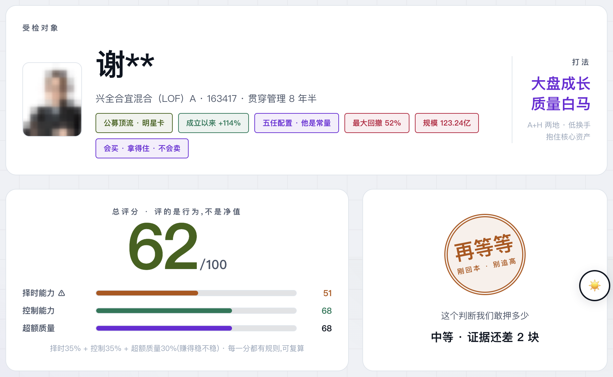

### 平台评分对照 · 84 vs 62

天天基金给他 84，我们只给 62 —— 差的 22 分，主要差在平台没看他"什么时候卖"。

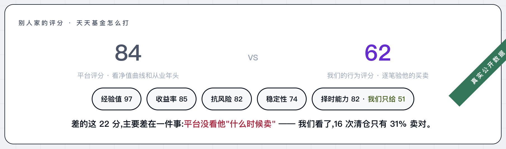

### 战役回放 · 真实周 K + 逐笔买卖点

左边是他赚最多/亏最多/卖飞的股票榜，右边真实 K 线上标出每次买卖：绿点买入、红点主动卖、黄点被动减（触 10% 线 / 遭赎回），还有成本线和卖出线。按「战役回放」K 线逐周生长，当年的新闻和他的操作一帧帧重演。

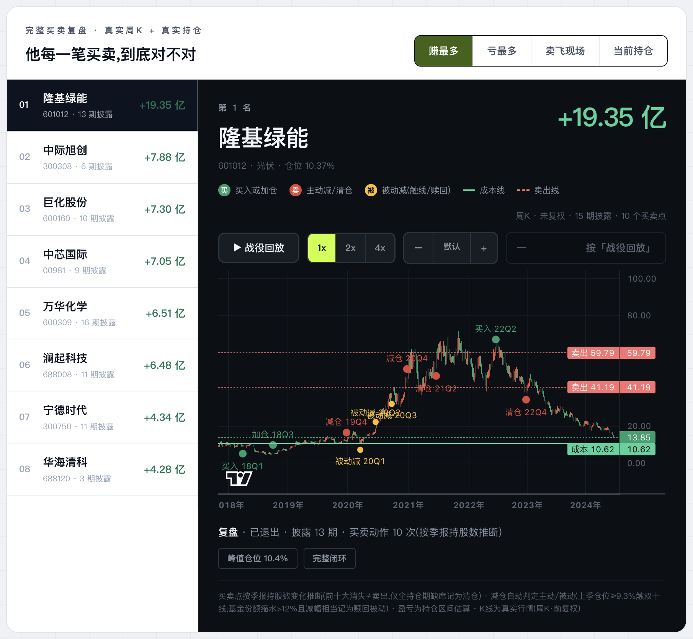

### 买卖点验尸 · 65 次买入 + 16 次清仓全部验尸

每个动作拿 12 个月后的走势验：买点胜率 58%（跑赢大盘算赢），清仓躲跌率只有 31%。结论一行字：**会买，不会卖。**

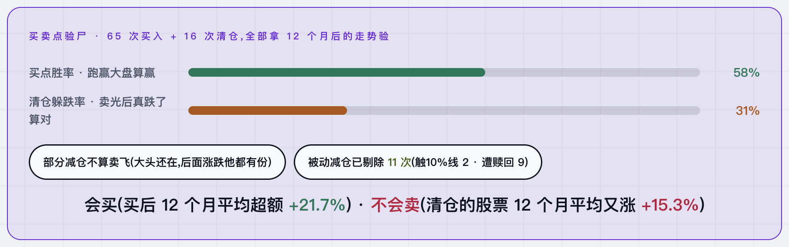

### 最好与最差的决策

澜起科技加仓后 12 个月 +227%；三安光电清仓后又涨 119%（卖飞）。赢和输都摆出来 —— 只挑赢家写，报告就没有可信度了。

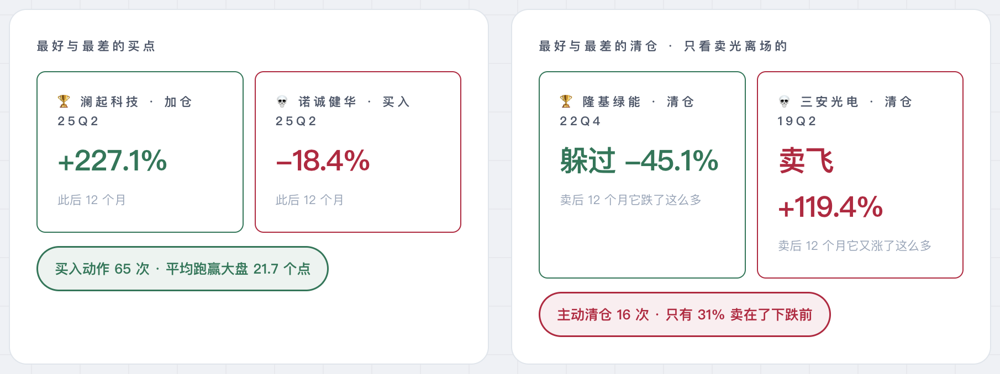

### 被套时他干什么 + 跌市防守

股票跌破成本后的 32 次动作：20 次认错砍掉 vs 12 次越跌越买 —— 偏纪律型，不死扛。旁边是四个熊市年的防守成绩单。

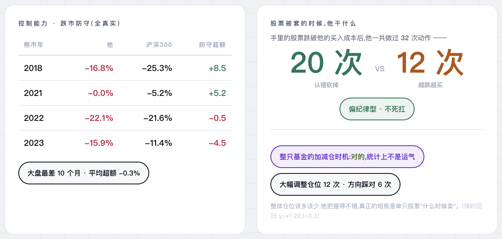

### 独立战争 · 他和公司有多不一样

分歧度标尺：他 78.8%，同事间均值也差不多 —— 不是孤狼。关键在下一步：分歧最高的季度 vs 最低的季度，随后 6 个月谁跑赢了大盘。

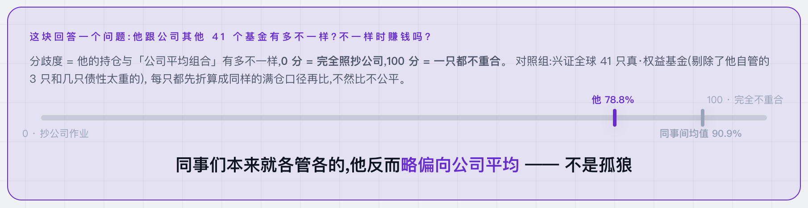

### 现在的牌面 · 前十大按行业归堆

芯片 & AI 算力 23.3% 是绝对主线，创新药 10% 打辅助 —— 典型科技成长打法，涨跌跟半导体周期共振。

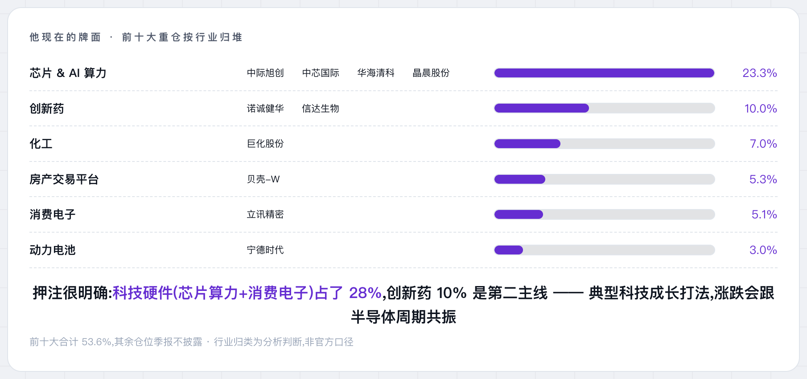

### 持仓撞车榜 · 同门 + 全市场

同门里谁跟他最像、全市场哪些主动基金也重仓他的票，全部配重合度进度条。想深挖哪只，直接让 Agent 再跑一遍。

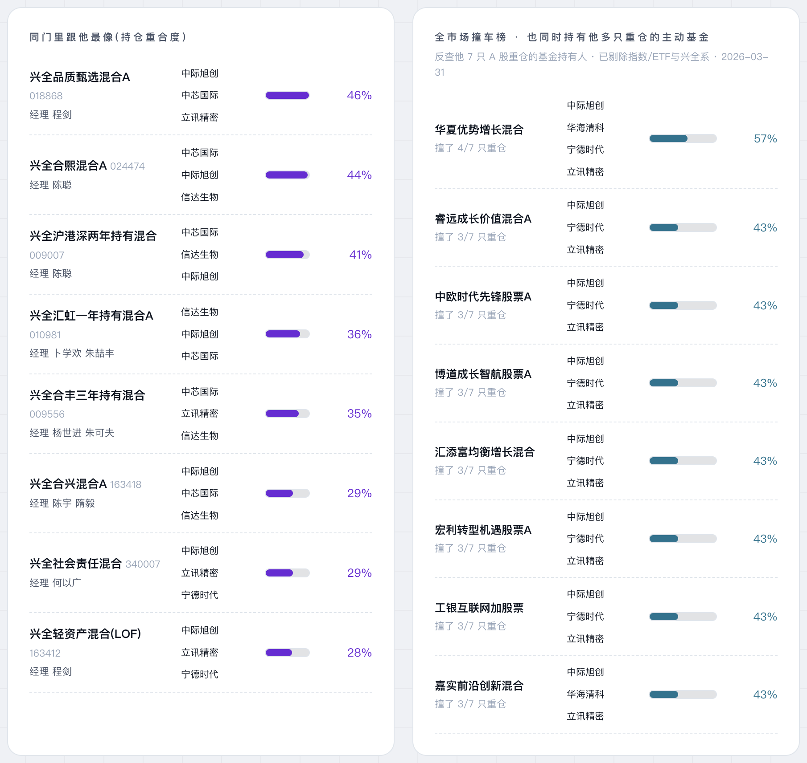

### 今年最猛的 10 只 · 持仓同步度

今年收益榜前十平均只跟他撞 0.8/10 只重仓 —— 他的收益不是追热点榜追来的。

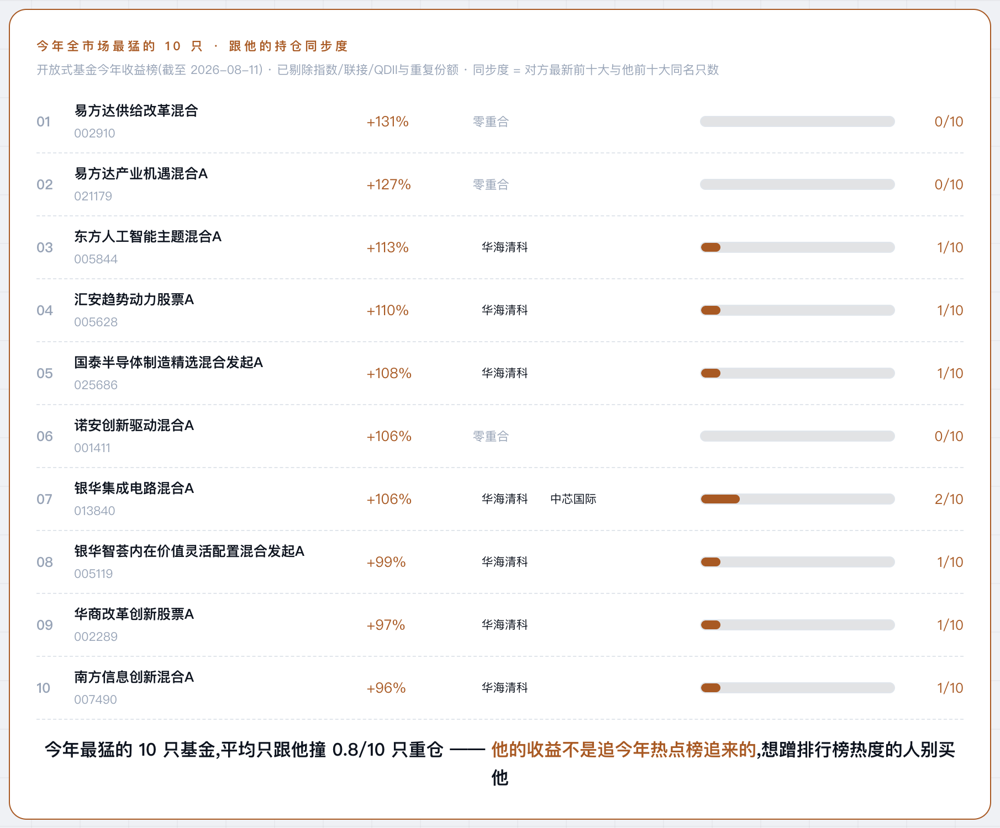

### 抄作业指数 · 他建仓 vs 你等季报

等季报再抄，超额还能拿 80% —— 买点先手一年只值 4.4 个点，跟他的择时弱项互相印证。

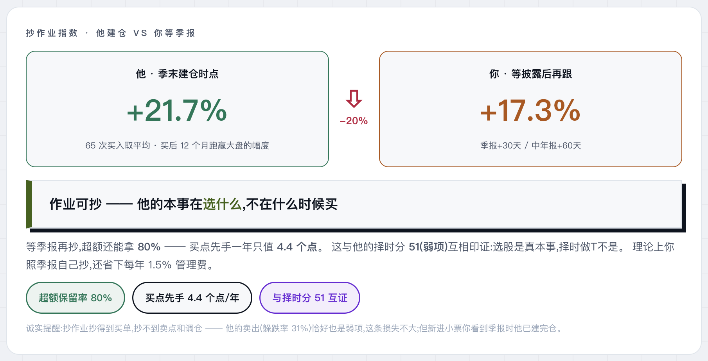

### 万元灾难片 · 你会怎么亏

拖动滑块选金额，直接看"如果买在 2021 年山顶"你的钱会变成多少、要熬多少天才回本。

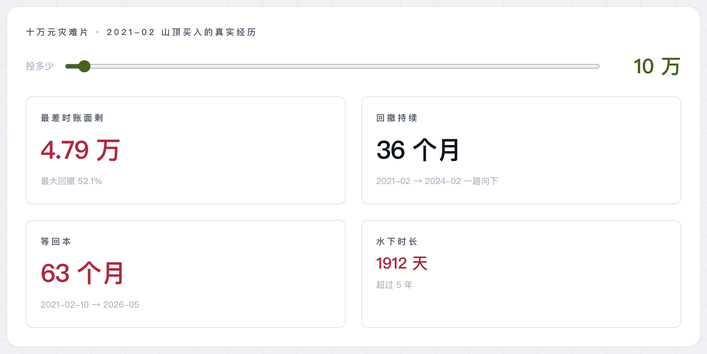

### 机构视角 · 上行/下行捕获

机构评基金最看重的一组数，配人话注释。

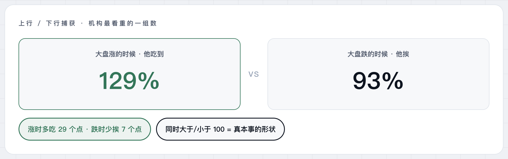

### 运气拆解 · 收益里有多少是风格白送的

把 103 个月的收益拆给市场/大小盘/成长价值，剥完还剩每年 +7.7% —— 这才是他的真本事。

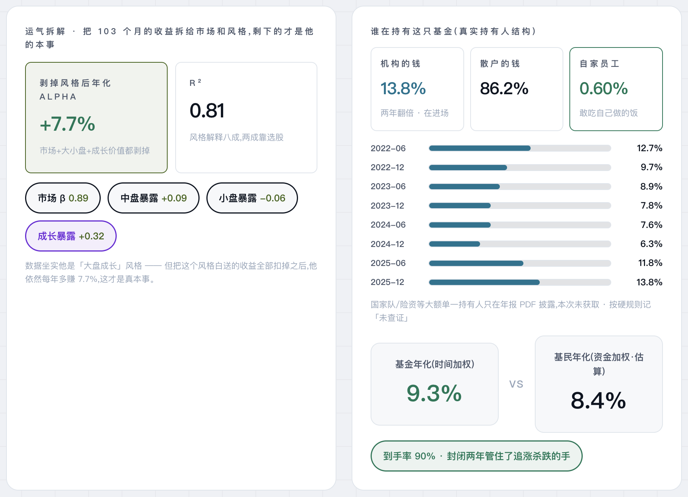

### 造神检测 · 明星经理黑历史扫描

甩锅跑路 / 摘桃子 / 藏尸体 / 高位圈钱，逐项核查。查不清的标"未查证"，不写成"不存在"。

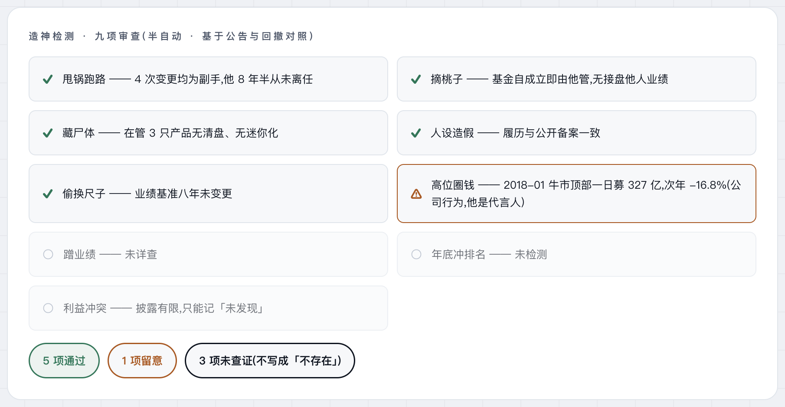

---

## 🎨 三种报告风格

主报告(上面那套)之外,还有三种完整的风格原型,同一套方法论、三种完全不同的叙事皮肤(当前为模拟数据演示,可作为渲染模板切换):

### 风格 A · 侦查卷宗 —— 「绝密档案」

牛皮纸+公章+批注,把基金经理当嫌疑人查:人事档案、物证、结案书。 [在线看](https://wbh604.github.io/fund-guy-skill/assets/style-a-dossier.html)

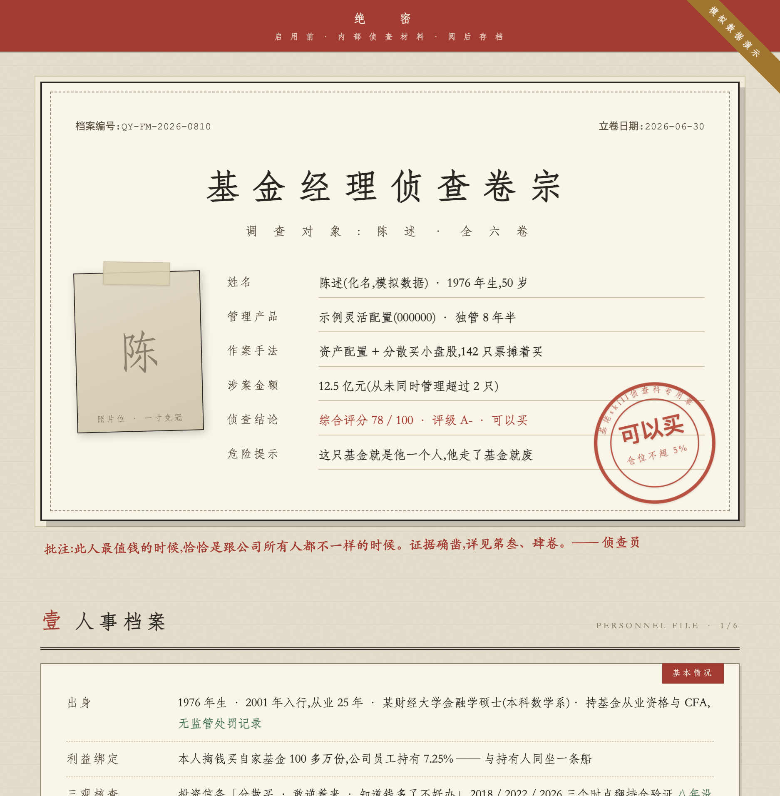

### 风格 B · 卡牌图鉴 —— 「你抽到了一张 SSR」

游戏抽卡语言:稀有度、属性面板、对战记录、阵亡回放、强度榜。 [在线看](https://wbh604.github.io/fund-guy-skill/assets/style-b-card.html)

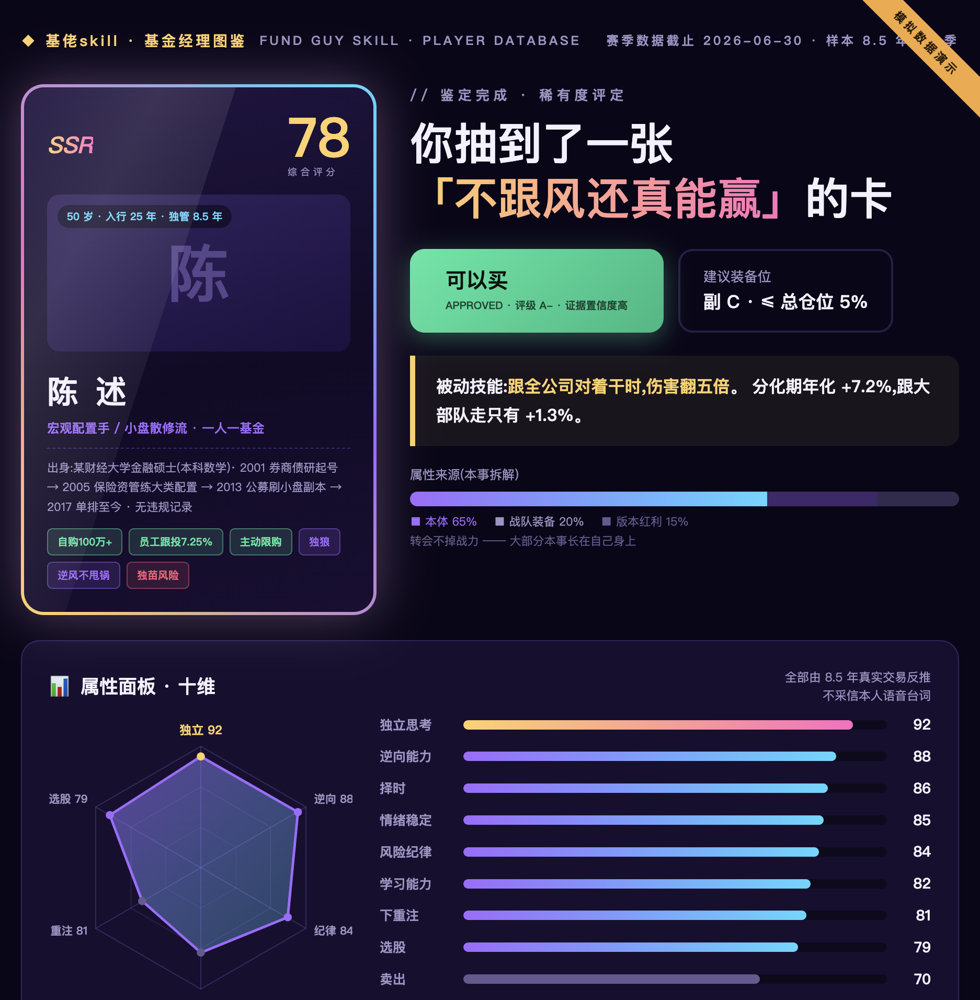

### 风格 C · 体检报告 —— 「各项机能基本健康,但天冷就犯病」

体检中心语言:总检结论、检验科、既往病史、Rx 医嘱与剂量控制。 [在线看](https://wbh604.github.io/fund-guy-skill/assets/style-c-checkup.html)

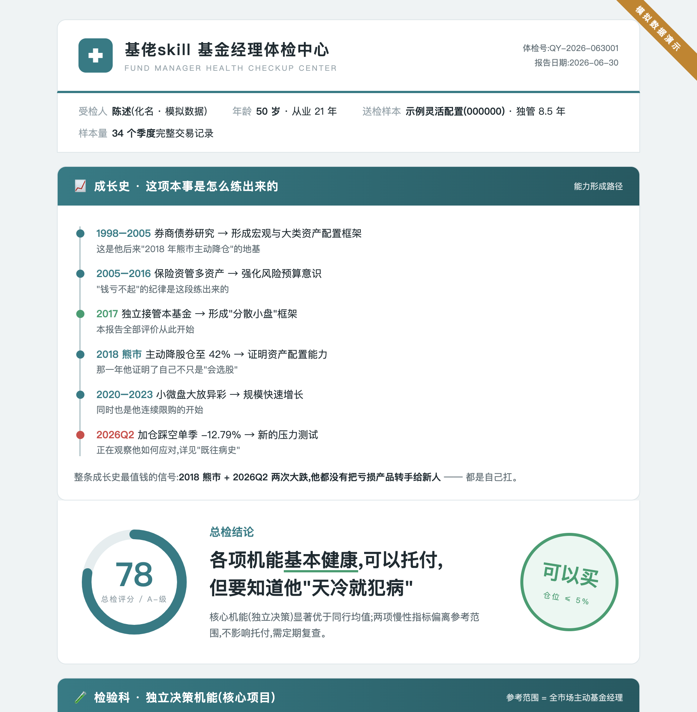

---

## 快速开始

```bash
python3 -m venv .venv && .venv/bin/pip install -r requirements.txt

# 以兴全合宜 163417 为例:取数 → 分析 → 出报告
.venv/bin/python scripts/fetch_fund.py 163417           # 基金主数据(净值/持仓/经理/持有人)
.venv/bin/python scripts/fetch_stock_klines.py 163417   # 重仓股周K(baostock + 新浪)
.venv/bin/python scripts/fetch_pingzhong.py 163417      # 天天基金 pingzhongdata(申赎/平台评分/照片)
.venv/bin/python scripts/fetch_house.py 163417          # 同门基金持仓(独立战争对照组)
.venv/bin/python scripts/fetch_market_similar.py 163417 # 全市场撞车榜反查
.venv/bin/python scripts/fetch_top_funds.py 163417      # 今年收益 TOP10 同步度
.venv/bin/python scripts/analyze_fund.py 163417         # 行为分析:验尸/评分/被动减仓判定
.venv/bin/python scripts/analyze_house.py 163417        # 分歧度/市场共识
.venv/bin/python scripts/build_fund_report.py 163417    # 生成单文件报告 assets/fund-<code>.html
```

### 在 Cursor / Claude Code / Codex 里用

把仓库丢给 Agent，说：

> 读 `SKILL.md`，按里面的流程分析基金 163417，参考脚本在 `scripts/` 下。

脚本是**一次真实运行的参考实现**。接口会改版，换基金/换环境时以 `SKILL.md` 的三层取数模型为准，由 Agent 自行取数、自行做定性判断（公告解读、行业归类、造神检测），脚本仅作参考。

---

## 方法论铁律

完整 16 条见 [`SKILL.md`](SKILL.md)，最重要的几条：

1. **直观是最高理念** —— 每个裸数字必须有主语和口径，回归系数只能进小字括号
2. **必须先做任期切割** —— 前任业绩混入现任评价 = 分析作废
3. **禁止把 Beta 当 Alpha** —— 风格白送的收益必须先剥离
4. **卖飞只认主动清仓** —— 部分减仓大头还在，被动减仓（触 10% 线/遭赎回）不是决策，全部剔除
5. **失败的独立判断必须全部记录** —— 只挑赢家写 = 整个报告失去可信度
6. **不许伪精确** —— 算不出来就写"未获取"，绝不编数
7. **证据不足标 U（未鉴定）** —— 把"查不清"当"能力差"是误伤

设计决策全记录在 [`DESIGN.md`](DESIGN.md)。

## 数据来源

全免费、零 API key：

| 数据 | 来源 |
|---|---|
| 净值 / 规模 / 申赎 / 持有人 / 经理档案 / 平台评分 | 天天基金（东方财富） |
| 逐季持仓 / 基金排行 | 东方财富，经 akshare |
| 全市场持仓横截面 | 巨潮资讯，经 akshare |
| A 股周 K（前复权） | baostock |
| 港股周 K | 新浪财经，经 akshare |
| K 线图表库 | TradingView Lightweight Charts (Apache-2.0) |

所有原始数据落 `.cache/` 留证（不入库），记录接口名+参数与抓取时间；查不到出处的数字不许进报告。报告末尾自带完整数据来源标注。

## 免责声明

> ⚠️ 本项目仅供学习研究，全部基于公开披露数据，**不构成任何投资建议**。基金过往业绩不预示未来表现；报告中的判断有效期至下一期持仓披露。
